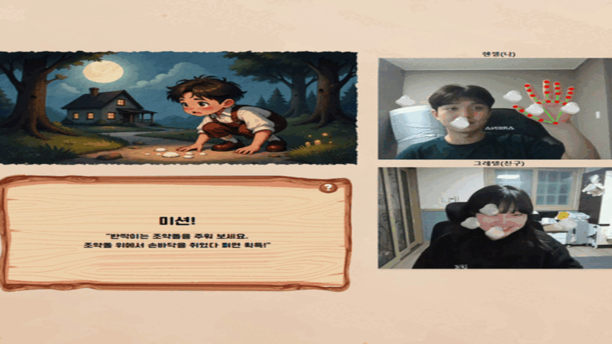
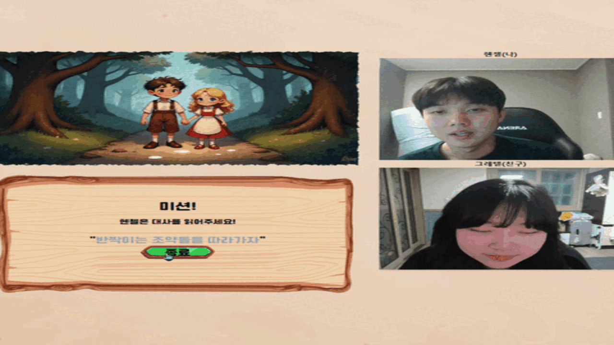
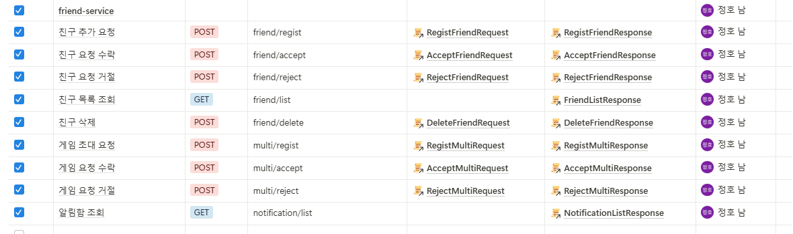
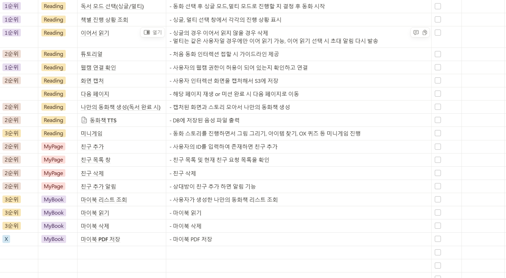

# SSAFY 12기 E201 Mongle - 쏙쏙

### 🤗 이야기 속으로 쏙, 
### 🚀 지식이 마음에 쏙! 
### 🤩 쏙쏙과 함께 성장하는 즐거움


<br>

## 목차

> - [👋 프로젝트 소개](#프로젝트-소개)
> - [📖 쏙쏙 컨셉](#쏙쏙-컨셉)
> - [✏️ 주요 기능](#주요-기능-및-기술-활용)
> - [👩‍👩‍👧‍👧 팀원 소개](#팀원-소개)
> - [🖲️ ERD](#ERD)
> - [📌 API 명세서](#API-명세서)
> - [🚨 기능명세서](#기능명세서)
> - [📋 배포 링크](#배포-링크)
> - [💻 아키텍쳐 구조도](#아키텍쳐-구조도)
> - [🖥️ 기술 스택](#기술-스택)


<br>

## 프로젝트 소개
 - 서비스 명: <b>쏙쏙 (Ssok Ssok) 
 - ✅ 사용자가 동화 속 주인공이 되어 직접 동작과 음성을 활용하여 스토리를 진행하는 참여형 인터렉티브 동화 플랫폼
 - ✅ 아이들은 단순한 시청자가 아닌 능동적인 참여자가 되어 몸을 움직이고 대사를 말하며 동화를 체험가능
 - ✅ MediaPipe 기반 동작 인식을 통해, 사용자의 손짓이나 몸짓이 실시간으로 감지되어 스토리의 흐름과 상호작용에 직접 반영
 - ✅ 제스처를 활용한 미션 수행, 대사 따라 말하기 등 다양한 방식으로 동화 몰입도와 흥미를 높임

<br>

## 쏙쏙 컨셉
### 🎀 몰입형 동화 체험 
- 사용자가 동화 속 캐릭터로 변신하여 직접 스토리를 이끌어나감 
### ✨ 모션 인식 기반 인터랙션
- 사용자의 몸짓을 AI가 실시간으로 인식하여 동화 속 행동으로 반영
### 🎄 게임 요소
- 특정 동작을 수행하면 이벤트가 발생하여 흥미 유발
### 🫂 가족/친구와 협력 플레이
- 한 명 이상이 함께 참여할 수 있도록 멀티 유저 모드 제공

<br>

## 주요 기능 및 기술 활용
### 시연 영상(YouTube)
[](https://youtu.be/3BXyRPZQ93U)
### 📸 모션 캡쳐 & 실시간 영상 처리
 - 사용자의동작을 실시간으로 인식하여 스토리 진행
 - ex) 조약돌 줍기 -> 조약돌 줍는 모션으로 스토리 진행

 
### 🎊 이벤트 트리거 
 - 특정 모션을 취했을 때 이벤트 발생
 - ex) 쿠키 미션에서 카메라에 입을 벌렸다 오므리면 쿠키 먹는 이벤트 발생


### 🔊 음성 인식 & 대화형 진행
- 특정 대사를 직접 말하면서 동화가 진행 (아이들이 직접 주인공이 되어 대화 따라하기)

 
### 🎮 게임 요소 진행 
- webRTC와 socket을 사용하여 실시간으로 친구와 상호작용
- 동화 진행 중 미션 수행 (ex 마녀와 가위바위보)

 
### 📷 나만의 앨범 생성
- 동화 진행 중 엄지 척 모션을 통한 화면 캡처로 사용자가 기억하고 싶은 순간을 저장


<br>

## 팀원 소개
| 이름 | 역할 |
|:--:|:--:|
| 👑 **[이동규 (팀장)](https://github.com/Iwannabegosu)**| BE & INFRA|
| 🌟 **[김나영](https://github.com/skdud5126)** | FE |
| ✏️ **[남정호](https://github.com/jhnam0324)** | BE |
| 🐶 **[송지영](https://github.com/xongeeuse)** | FE |
| 🎉 **[유지인](https://github.com/Yu-jiin)** | FE |
| 🚀 **[이가람](https://github.com/garam0107)** | BE |

<br>

## ERD


<br>

## API 명세서
### - 동화 관련 API

### - 유저 관련 API

### - 친구 관련 API


<br>

## 기능명세서



<br>

## 배포 링크

https://j12e201.p.ssafy.io/

<br>


## 기술스택

```
Front-End
- React, TailwindCSS, Zustand, node.js, JavaScript

Back-end 
- Java
- Spring Boot
- Spring Web
- Spring Security
- Spring cloud gateway
- Spring cloud netflix eureka
- redis
- mysql

Infra
- Ubuntu
- Docker
- Jenkins

```


<br>


## 아키텍쳐 구조도


---


